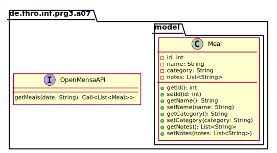

_This is an assignment to the class [Programmieren 3](https://hsro-inf-prg3.github.io) at the [University of Applied Sciences Rosenheim](http://www.fh-rosenheim.de)._


# Assignment 7: Composite and Observer

In this assignment, you will
- discover the model-view-controller (MVC) approach
- use the [OpenMensa API](http://doc.openmensa.org/api/v2/)
- review annotations for JavaFX and Retrofit
- see the [_composite_](https://en.wikipedia.org/wiki/Composite_pattern) pattern in action
- use variants of the [_observer_](https://en.wikipedia.org/wiki/Observer_pattern) patterns.

At the end of the day, you will have implemented a little app that retrieves the current meal plan of the cafeteria.
You can also opt for a (slightly more complex) [example using Android](https://github.com/hsro-inf-prg3/07-composite-observer).


> Note: JavaFX is been removed from recent JDKs.
> Use Java 8 to still get it.


# GUI with JavaFX

To get started, familiarize yourself with the given files of this project.

- `App.java`: This is the entrypoint to your application.
	The `main` method launches the JavaFX application, which is started in `start`.
	_Nothing needs to be changed here._
- `model.Meal` models an individual meal; the API will return a `List<Meal>` which is our _model_
- `api.OpenMensaAPI` is the interface that should describe the service; used by Retrofit
- `resources/main.fxml`: XML specification of how the GUI should look like, the _view_.
- `controllers.MainController`: the main GUI controller that we will be working on.

Examine the `MainController` class and `main.fxml` view definition.
You can see that the `GridPane` in the XML is linked to (an instance of the) `MainController`.
The buttons have an `fx:id` which match attributes annotated with `@FXML` and named just like the `fx:id`.
The `initialize()` function shows how to add an event listener to a buttons.
As you can see, the `ListView` interface is generic and uses an item list which should be `ObservableList<T>`.

## TODO

- Modify the controller so that it has an attribute of type `ObservableList` as well as attributes for the _close_ button and _vegetarian_ checkbox.
- Add event handlers for both and try modifying the content of the above list; the interface name suggests that the list of observed by the list view, i.e. changes in the data structure should be reflected in the GUI.


# Data: OpenMensaApi

Now that you understood the basic GUI elements and how to "bring them to life", let's look at where and how to get the data.

The [OpenMensa API](http://doc.openmensa.org/api/v2/) is an API to retrieve the menu of a certain day of a certain canteen.
In the previous assignment, we used [Retrofit](http://square.github.io/retrofit/) to interact with the API.
This time, we will use it again -- but don't worry you won't have to implement any TypeAdapters or anything else, it's straight forward this time.

* Add the method `getMeals` to the interface `OpenMensaAPI` (as shown in the following UML).
	Make sure to use the correct annotations to make the proper call.
* Complete the test in the class `OpenMensaAPITests` to ensure that your implementation is working correctly.



**Hints:** 
- As shown last week, parameters of methods have to be mapped to parameters in the annotation.
	The inline comment in the interface shows the actual query we want to produce, which requires canteen id and date (Rosenheim is 229).
- The `Meal` class is provided.
- Check out the `setup()` provided in `OpenMensaAPITests`: it adds an interceptor to Retrofit that will print out every request (and response) on the logcat.


# Putting the Pieces Together

Change your code so that once you click the _refresh_ button, it retrieves today's menu, and renders the dishes' names on the list view.

**Hints:**
- You can get today's date from the `Calendar` API using the `SimpleDateFormat` helper class:
	
```java
SimpleDateFormat sdf = new SimpleDateFormat("yyyy-MM-dd", Locale.getDefault());
String today = sdf.format(new Date());
```

- You will need to map the list of `Meal`s to a list of `String`s.
- It is discouraged to run code on the UI thread; use the `Call.enqueue()` instead of the `Call.execute()` method, and pass it a `Callback<>` handler.
- In the network callback, make sure to check if the response was successful, by checking `response.isSuccesful()` (which returns true for `2XX` codes).


# Filter the Meals

The last part is to implement the filter for vegetarian meals only.
Unfortunately, the API does not expose any marker so we will use a simple workaround:
a meal is vegetarian if none of the notes contains the string `"fleisch"`.

> Note: The solution is **really** simple, no regular expressions or alike needed.

- Add a `isVegetarian()` method to the `Meal` class using the above workaround.
- Change your code so that it filters the results if the checkbox is checked.

> Note: Kudos if you can also trigger a refresh if the checkbox selection changes.
